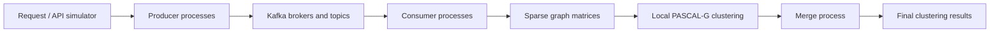

# A Streaming Kafka Pipeline for Graph Analysis with PASCAL-G

A University of New Mexico research pipeline for transforming streaming text into graph clusters using Apache Kafka, PASCAL-G, Docker, and Kubernetes on the National Research Platform's Nautilus infrastructure.

The pipeline connects data ingestion, sparse graph construction, local clustering, and result merging in a distributed workflow. It supports research on how data movement, parallel execution, and coordination between stages affect the performance and completeness of streaming analytics.

## Research purpose

Continuous text streams contain changing relationships between words and topics. This project represents those relationships as **weighted word co-occurrence graphs** and applies **PASCAL-G** to identify groups of related nodes. Processing successive time-window snapshots provides a way to study how community structure changes as new text arrives.

The project brings together high-performance computing, graph mining, and distributed stream processing. Its research objectives include:

- Ingesting and processing large collections of streaming text.
- Building sparse graph representations suitable for distributed analysis.
- Computing local clusters and combining them into a graph-level result.
- Investigating the performance and data-completeness requirements of a multi-stage cloud pipeline.

## How the system works

| Component | Role in the workflow | Implementation |
| --- | --- | --- |
| Request | Retrieves or simulates incoming text snapshots and stages input for producers. | [`src/request/`](src/request/) |
| Producer | Preprocesses text, constructs hashed word co-occurrence records, and sends batches to Kafka. | [`src/producer/`](src/producer/) |
| Kafka | Buffers records between ingestion and downstream processing. | [`helm/`](helm/), [`charts/`](charts/), [`k8s/`](k8s/) |
| Consumer/application | Assembles sparse graph data and runs local PASCAL-G clustering. The deployment pairs consumer and application containers with shared storage. | [`src/consumer/`](src/consumer/), [`src/application/`](src/application/) |
| Merge | Reads local clustering outputs and combines them into a final result. | [`src/merge/`](src/merge/) |

**Example:** if “fire” and “smoke” occur together in a text document, they contribute a connection between those words. Repeated co-occurrence increases that connection's weight. Clustering groups nodes according to graph structure; it does not, by itself, classify sentiment or verify the truth of a document.

## PASCAL-G and parallel processing

PASCAL-G builds clusters from arriving graph nodes using vector representations called **fingerprints**. A fingerprint summarizes information about a cluster and changes as nodes are assigned to it. Local clustering produces partial results; a subsequent merge combines sufficiently similar fingerprints.

This separation lets the pipeline distribute local analysis and then consolidate its outputs. The application maintains cluster information and requires a defined merge step: independent ingestion or local execution should not be confused with a completely stateless end-to-end computation.

The broader NSF project also developed MPI and Dask versions of PASCAL-G. The separate algorithm repository is [`nidiamcl/stream-graph`](https://github.com/nidiamcl/stream-graph). Reported MPI scaling results are documented separately from the Kafka/Kubernetes pipeline findings.

## Deployment and configuration

The reported deployment used Docker containers, Kubernetes StatefulSets, shared persistent volumes, and the Bitnami Kafka Helm chart on Nautilus. Replica counts allow multiple instances of pipeline stages. Consumer and application containers share intermediate graph data, while a merge component combines their local outputs.

Relevant configuration includes producer and consumer process counts, topic layout, batch size, input and output paths, clustering thresholds, broker settings, and storage access. The producer implementation distributes hashed graph records across **topic names**; this is distinct from assigning Kafka partitions within a topic to consumers.

| Directory | Contents |
| --- | --- |
| `src/` | Request, producer, consumer, clustering, and merge programs. |
| `k8s/`, `helm/`, `charts/` | Kubernetes resources and Kafka deployment configuration. |
| `dockerfiles/` | Container image definitions and supporting files. |
| `shell-scripts/` | Build, deployment, launch, and output-management scripts. |
| `docs/` | Architecture, research findings, provenance, and reproduction guidance. |

Start with the [reproduction guide](docs/Reproduction-and-next-steps.md). It identifies configuration prerequisites and known launcher/completeness checks that need validation before running the workflow. The repository contains research implementation code; the documentation update does not establish a tested one-command deployment on a current cluster.

## Reported research outcomes

The NSF project report describes an implemented Kafka/Kubernetes workflow for streaming graph analysis and evaluation using social-media graph snapshots. It reports **775 hourly Ukraine-related network snapshots with up to approximately 45,000 nodes each**. Larger tweet counts in the report describe source collections, not verified counts successfully processed end to end in a single pipeline experiment.

A central finding was the importance of **data completeness across dependent stages**. The report describes missing producer-to-consumer data affecting clustering quality and proposes further sequence-tagging work to identify, track, and verify batches. These observations motivate explicit completion and integrity checks alongside performance measurements; they do not establish a general failure of Kafka or a completed exactly-once delivery mechanism.

The [findings page](docs/Findings-and-limitations.md) separates pipeline observations, dataset scope, MPI results from the broader project, and source-review findings. No new benchmark or deployment results are claimed by this documentation revision.

## Project context and research products

This repository is named in the Research.gov final annual project report preview for **NSF award 1807563**, *CDS&E: Optimization of Advanced Cyberinfrastructure through Data-Driven Computational Modeling*, at the University of New Mexico. The report lists the 2024 `sjafari2/K8sKafkaPipeline: K8s-Kafka-DataStreaming-Pipeline` product under **NSF-PAR record 10489782**.

- [NSF award record](https://www.nsf.gov/awardsearch/showAward?AWD_ID=1807563)
- [Version 1.0 source](https://github.com/sjafari2/K8sKafkaPipeline/tree/v1.0)
- [Project history, contributors, and report references](docs/Project-history.md)
- [Architecture and data flow](docs/Architecture-and-data-flow.md)
- [Reported findings and limitations](docs/Findings-and-limitations.md)
- [Wiki source pages](docs/wiki/Home.md)

The project credits **Soheila Jafari Khouzani, Nidia Vaquera Chavez, Patrick Bridges, and Trilce Estrada**. The history page describes documented roles and distinguishes this collaborative pipeline from the separate development of parallel PASCAL-G algorithms.

## Related research direction

Experience with this workflow motivates continued investigation of resource allocation, workload distribution, and reliable completion in streaming systems. The related [`RealTime-Streaming-Pipeline`](https://github.com/sjafari2/RealTime-Streaming-Pipeline) project studies Kafka workload skew and mitigation decisions. Its synthetic scaling experiments are a separate study, not measurements of this PASCAL-G pipeline.
