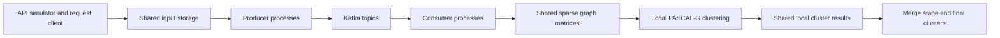

# Architecture and data flow

The historical pipeline transforms text snapshots into weighted word co-occurrence graphs and then computes PASCAL-G clusters. The report describes deployment on NRP Nautilus using Docker, Kubernetes StatefulSets, shared persistent volumes, and Bitnami Kafka Helm configuration (pp. 2-3).

| Stage | Responsibility | Source location |
| --- | --- | --- |
| Request | Obtain and stage input snapshots | `src/request/` |
| Producer | Preprocess words; construct hashed co-occurrence records; send to Kafka | `src/producer/mainProducer.py`, `KafkaProducer.py` |
| Kafka | Buffer records for consumer retrieval | `helm/`, `charts/`, `k8s/` |
| Consumer | Assemble sparse graph representations | `src/consumer/` |
| Application | Find local clusters from the graph data | `src/application/findClusters.py`, `runapplication.sh` |
| Merge | Consolidate local clustering results | `src/merge/merge_step.py`, `runmerge.sh` |
| Operations | Build, deploy, launch, and copy outputs | `dockerfiles/`, `shell-scripts/` |

A word is a graph node; repeated co-occurrence contributes edge weight. The producer source computes `hash_value % num_topics` and selects a topic suffix. This is graph sharding across topic names; it must not be described as identical to Kafka partition assignment within one topic. A hash collision remains possible and needs measurement rather than a collision-free guarantee.

PASCAL-G uses cluster fingerprints and merges sufficiently similar fingerprints. The separate MPI/Dask algorithm work belongs to the broader collaborative project. An algorithm's robustness to node order does not establish transport completeness or end-to-end delivery order.

The report describes a feedback notification from merge to request. At the reviewed source revision, the notification in `src/merge/runmerge.sh` is commented out. Treat that feedback loop as documented design, not a verified active behavior of this checkout.
